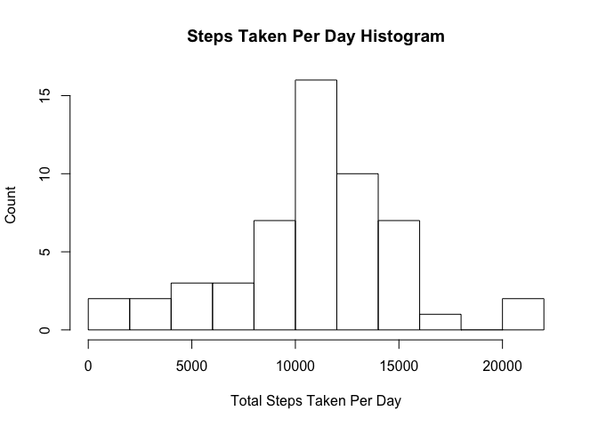
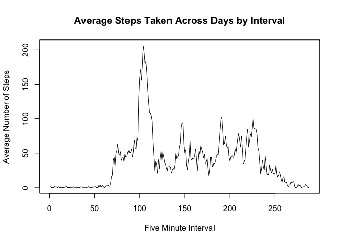
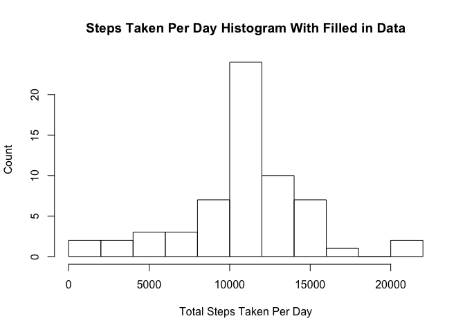
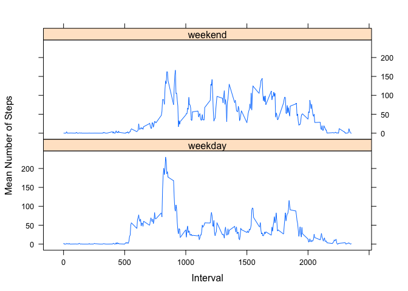

# Reproducible Research: Peer Assessment 1

Unzip and read source data. We will also load libraries that we will use later in analysis at this stage.

## Loading and preprocessing the data

```r
library(lattice)
library(dplyr)
```

```
## 
## Attaching package: 'dplyr'
```

```
## The following objects are masked from 'package:stats':
## 
##     filter, lag
```

```
## The following objects are masked from 'package:base':
## 
##     intersect, setdiff, setequal, union
```

```r
unzip("activity.zip")
activity_raw <- read.csv("activity.csv")
activity_no_na <- na.omit(activity_raw)
```


## What is mean total number of steps taken per day?
This section makes use of the dplyr library, which is covered extensively in the getting and cleaning data course. Very good swirl tutorials are available for dplyr.


```r
steps_grouped_by_day <- group_by(activity_no_na, date)
daily_summary <- summarise(steps_grouped_by_day, total_steps = sum(steps))

daily_mean <- mean(daily_summary$total_steps)
daily_median <- median(daily_summary$total_steps)

hist(daily_summary$total_steps, breaks = 10, ylab = "Count", xlab = "Total Steps Taken Per Day", main = "Steps Taken Per Day Histogram")
```

\


#### Mean number of steps taken each day: 10766.19

#### Median number of steps taken each day: 10765.00

## What is the average daily activity pattern?

Group days together and examine the activity over intervals. Find the interval with the highest average number of steps across days


```r
steps_grouped_by_interval <- group_by(activity_no_na, interval)
interval_summary <- summarise(steps_grouped_by_interval, mean_steps = mean(steps))


interval_summary_sorted <- arrange(interval_summary, desc(mean_steps))

max_interval <- interval_summary_sorted$interval[1]

num_steps_in_max_interval <- interval_summary_sorted$mean_steps[1]

plot(interval_summary$mean_steps, type = "l", xlab  = "Five Minute Interval", ylab = "Average Number of Steps", main = "Average Steps Taken Across Days by Interval")
```

\

#### Interval with highest average steps across days: 835 (average steps: 206)


## Inputing missing values


```r
missing_value_count <- nrow(activity_raw) - nrow(activity_no_na)
```

#### Total number of missing values: 2304

The strategy for filling in missing values shall be to use the mean for the 5 minute interval. We will achieve this by createing a summary table that holds the average for each interval across days. This sumamry table will be joined to all the missing values which will then be combined with collected data using rbind and sorted. The daily mean and median values will be calculated for this filled-in set.


```r
activity_na_only <- subset(activity_raw, is.na(activity_raw$steps))
patch <- left_join(activity_na_only, interval_summary)
```

```
## Joining by: "interval"
```

```r
patch$steps<-patch$mean_steps
patch$mean_steps <- NULL
patched <- arrange(rbind(activity_no_na, patch), date)

steps_grouped_by_day_patched <- group_by(patched, date)
daily_summary_patched <- summarise(steps_grouped_by_day_patched, total_steps = sum(steps))


daily_mean_patched <- mean(daily_summary_patched$total_steps)
daily_median_patched <- median(daily_summary_patched$total_steps)

hist(daily_summary_patched$total_steps, breaks = 10, ylab = "Count", xlab = "Total Steps Taken Per Day", main = "Steps Taken Per Day Histogram With Filled in Data")
```

\


#### Mean number of steps taken each day for patched data: 10766.19

#### Median number of steps taken each day for patched data: 10766.19


## Are there differences in activity patterns between weekdays and weekends?

Here we will add another variable to the filled in set and apply the values "weekend" or "weekday" to this new variable. We will then plot the weekend and weekday timeseries together. By examining the graph we can see that there appear to be differences between weekends and weekdays.


```r
patched$weekday <- ifelse(weekdays(as.Date(patched$date)) == "Saturday" | weekdays(as.Date(patched$date)) == "Sunday", "weekend", "weekday")
patched_grouped_by_weekend_interval <- group_by(patched, weekday, interval)

final_set <-summarize(patched_grouped_by_weekend_interval, mean_steps = mean(steps))

with(final_set, xyplot(mean_steps ~ interval | factor(weekday), type = "l", layout = c(1,2), xlab = "Interval", ylab = "Mean Number of Steps"))
```

\
